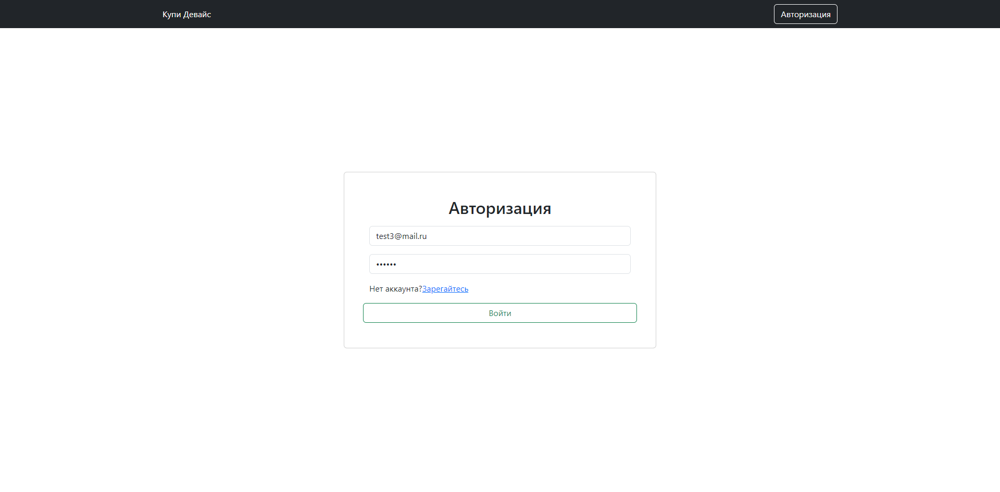
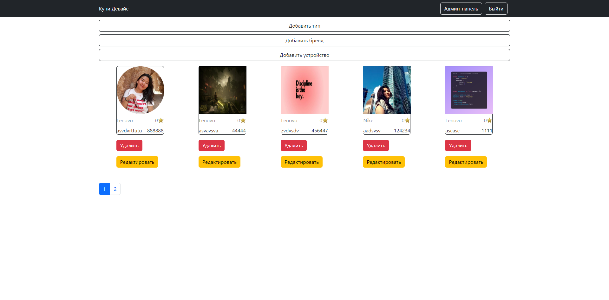

<h1>Online store made on React, React-redux tooolkit, react-route</h1>
<h1>Backend: Node.js, DB Postgre sql, ORM Sequelize</h1>
<h2>Пока проект в работе, над стилями еще не работала. Занимаюсь преимущественно функционалом</h2>
<h3>Главная страница</h3>

Можно переходить по категориям и бренда, работает пагинация

<h3>Авторизация и регистрация</h3>

Все записывается в таблицу Users

<h3>Админ-панель</h3>

Можно удалять, добавлять и редактировать товары. Добавлять новые типы и бренды.

<h3>Интерфейс добавления новых товаров</h3>

Записывается в соответствующие таблицы

